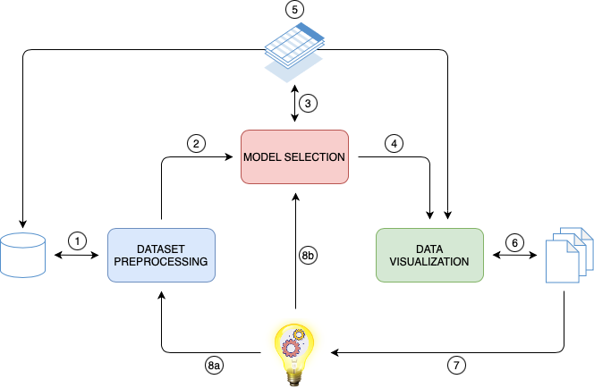

# Fake news detection based on the induction of fuzzy sets
This git repository shows the work of Giovanni Laganà's final thesis of his master's degree at Università degli Studi di Milano, about the extension of the algorithm described in [1], observing how the choice of input formatting techniques [2] will affect the learning results, focusing on the problem of detecting the reliability score of news published on online newspapers.

# Repository structure
This repository is structured as follows:
- <i>modules</i>:
    * ```main_generative.py```: the module which generates syntetic texts through LDA
    * ```main_kaggle.py```: the module which downloads a specified dataset from Kaggle
    * ```main_dataset_preparation``` the module that converts raw datasets into a standard format for this system
    * ```main_preprocessing.py```: the module that runs a complete preprocessing pipeline from scratch
    * ```main_use_preprocessed.py```: the module that lets you run a preprocessing pipeline in a second moment
    * ```main_model_selection.py```: the module that selects the best model by doing a grid search on a set of parameters for Fuzzy Inductors ([mulearn](https://github.com/dariomalchiodi/mulearn) package).
    * ```main_use_model.py```: the module that deserializes those models found through grid search and lets you use them in a second moment
    * ```main_plot.py```: the module that plots points in a 2D space and shows how the membership is determined by the selected models
    Moreover, it serializes the models found and stores their configuration and scores in a .csv file
    <!-- * ```main_experiment.py```: the module that launches the experiments and stores them in a .csv file" -->
    * ```main_models_viewer.py```: the module that reads the .csv file generated by the previous module and display the models found

- <i>classes</i>:
    <!-- * ```experiment.py```: the class responsible for creating, fitting and using a predicitive model through the [mulearn](https://github.com/dariomalchiodi/mulearn) package -->
    * ```classes/generation```: the class that defines how the generative model works and its setup
    * ```classes/model.py```: the class for the models that we want to build and use
    * ```classes/ppsteps.py```: the class that implements the preprocessing operations with fit and transform functions, according to scikit-learn's [convention](https://scikit-learn.org/stable/developers/develop.html)
    * ```classes/preprocessing.py```: the class to configure the preprocessing pipeline with the operations that we want 
    
- <i>tests</i>:
    * ```tests/test_ppsteps.py```: the file where unitary tests for ```ppsteps.py``` are executed
    * ```tests/test_model.py```: the file where unitary tests for ```model.py``` are executed
    
- <i>generated files</i> (not shown in this repository):
    * ```datasets/fakeandreal/Fake.csv, True.csv```: the two .csv files from the dataset loaded from Kaggle
    * ```preprocessed_datasets/text/<date_time>/final_text_dataset_<samplesize>.csv```: the .csv file with the preprocessed data
    * ```preprocessed_datasets/text/<date_time>/dataset_fake.pickle, dataset_true.pickle```: the serialized preprocessed datasets divided in fake and real news
    <!-- * ```img/```: the folder containing all scatterplots generated by the experiments -->
    <!-- * ```results/experiments.csv```: the dataframe containing the configuration of experiments and their results -->
    * ```selected_models/models.csv```: the .csv file with the best models found, their configuration and their scores
    * ```selected_models/<date_time>/```: the folder containing as many serialized models as the number of external folds
    * ```generated_text/<date_time>/generated_dataset_<samplesize>.csv```: the folder containing those humand-readable syntetic texts generated by LDA model
    * ```generated_datasets/<date_time>/generated_dataset_<samplesize>.csv```: the .csv file with the preprocessed embedded generated data
    
# Data Flow Diagram


# Datasets (updated on 20/02/2021)
Currently, two main interesting datasets about web news have been found.
1. [Fake and real news dataset](https://www.kaggle.com/clmentbisaillon/fake-and-real-news-dataset?select=Fake.csv), 111 MB
2. [All the News 2.0](https://components.one/datasets/all-the-news-2-news-articles-dataset/), 9.2 GB 
3. [ProfNER](https://temu.bsc.es/smm4h-spanish/), 13.6 MB

# Datasets loading
The datasets presented in the section above are not included in this repository to avoid inefficiency.
The module ```main_kaggle.py``` automatically downloads data from Kaggle (currently this is done for dataset 1). 
Before executing the code, please, configure the Kaggle's API by the following steps:

* make sure to have Python 3 installed and correctly configured
* install the Kaggle's API by typing in console ```pip3 install kaggle```
* register to the Kaggle website
* go to ```https://www.kaggle.com/<username>/account``` and click the button "Create New API Token"
* the file downloaded in the previous step (```kaggle.json```) contains the credentials to login to the kaggle website: do not share with anyone
* Move this file to ```~/.kaggle/``` folder in Mac and Linux (if not present just create it) or to ```C:\Users\<User Name>\.kaggle\``` on windows.
Alternatively, you can populate KAGGLE_USERNAME and KAGGLE_KEY environment variables with values from kaggle.json to get the api to authenticate.

For any doubts, i recommend to read this very good [guide](https://technowhisp.com/kaggle-api-python-documentation/).

When all steps above are done, you can safely run ```main_kaggle.py```.
This script has the effect of creating a folder ```datasets/fakeandreal``` in your repository. 
This folder contains two .csv files, respectively about fake and real news.

# Dataset Preprocessing
Once your data is loaded into ```datasets``` folder, you can run ```main_preprocessing.py```.
This module has the effect of generating preprocessed datasets in ```preprocessed_datasets``` folder.
More specifically, it creates a subfolder ```text```, since we have chosen to analyze the corpus of news; 
within this folder, everytime a preprocessing pipeline is executed with the write flag enabled, it generates a folder ```<date_time>``` containing the serialized preprocessed dataframes, 
respectively about fake and real news.
Finally, a global .csv file is created with both fake and real news, labeled and shuffled.

# Model Selection
Assuming you have preprocessed cleaned dataset in ```preprocessed_datasets``` folder, you can run ```main_model_selection.py``` in order to perform a grid search such that the optimal configuration can be obtained.
Depending on the number of external folds of the cross validation, it generates a certain number of candidate models, each with a specific configuration and a set of scores.
In particular, scores have been computed by calculating the weighted version of precision, recall and f1.
All this information is stored into ```selected_models/models.csv```, a file that groups the history of all experiments done and the models that they produced. 
Moreover, with the same criterion of the previous module, subfolders are created and named ```<date_time>```, each of them contains <i>n</i> serialized models, one for each fold of the experiment.

<!--
# Experiments
If you want to launch the final experiments to see results, you have to run ```main_experiment.py``` which selects a model from ```selected_models/models.csv``` and run an experiment on the test set.
Whenever the plot flag is enabled, scatterplots are saved in ```img``` folder.
All experiments are saved in ```results/experiments.csv``` file.
-->

# Display of Models
When you want to display final models, you can run ```main_models_viewer.py``` to show the experiments outcome. 

# Data Generation
This step is useful if you want to feed your supervised model with generated data.
If you want to artificially generate syntetic text with a specific memberhip grade you can do it by running ```main_generative.py```, which runs an algorithm based on Latent Dirichlet Allocation from two topics.
With this script, you can set which probability distribution you want membership functions to follow and create in ```generated_texts``` folder a hybrid text where the fraction of words belonging to a certain topic is equivalent
to the membership grade of the text to be guessed later.
Afterwards, it is necessary to run ```main_use_preprocessed.py``` and select the configuration for generated datasets in order to run a simple preprocessing pipeline that has the aim of embedding words for future model selection.

# Bibliography
* [1] Learning Membership Functions for Fuzzy Sets through Modified Support Vector Clustering,
in F. Masulli, G. Pasi e R. Yager (Eds.), Fuzzy Logic and Applications. 10th International Workshop,
WILF 2013, Genoa, Italy, November 19–22, 2013. Proceedings., Vol. 8256, Springer International
Publishing, Switzerland, Lecture Notes on Artificial Intelligence (ISBN 978-3-319-03199-6), 52–59, 2013.  

* [2] Schütze, H., Manning, C. D., & Raghavan, P. (2008). Introduction to information retrieval 
Vol. 39, pp. 1041-4347). Cambridge: Cambridge University Press.  

* [3] Mikolov, T., Chen, K., Corrado, G., and Dean, J. (2013). Efficient estimation of word representations in vector space. arXiv preprint arXiv:1301.3781.
 Pham, T. T. (2018). A study on deep learning for fake news detection.  

* [4] Wardle, C. (2017). Fake news. it’s complicated. First Draft News.  

* [5] Andreas Vlachos and Sebastian Riedel. Fact checking: Task definition and dataset construction. ACL’14.  

* [6] Naeemul Hassan, Chengkai Li, and Mark Tremayne. Detecting check-worthy factual claims in presidential debates. In CIKM’15.  

* [7] Michele Banko, Michael J Cafarella, Stephen Soder- land, Matthew Broadhead, and Oren Etzioni. Open information extraction from the web. In IJCAI’07.  

* [8] Amr Magdy and Nayer Wanas. Web-based statistical fact checking of textual documents. In Proceedings of the 2nd international workshop on Search and mining user-generated contents, pages 103–110. ACM, 2010.  

* [9] You Wu, Pankaj K Agarwal, Chengkai Li, Jun Yang, and Cong Yu. Toward computational fact-checking. Proceedings of the VLDB Endowment, 7(7):589–600, 2014.  

* [10] Baoxu Shi and Tim Weninger. Fact checking in het- erogeneous information networks. In WWW’16.    

* [11] Giovanni Luca Ciampaglia, Prashant Shiralkar, Luis M Rocha, Johan Bollen, Filippo Menczer, and Alessandro Flammini. Computational fact checking from knowledge networks. PloS one, 10(6):e0128193, 2015.  

* [12] V.L. Rubin, Y. Chen, N.J. Conroy, Deception detection for news: three types of fakes 52 (1) (2015) 1–4.  

* [13] N.J. Conroy, V.L. Rubin, Y. Chen, Automatic deception detection: methods for finding fake news 52 (1) (2015) 1–4.  

* [14] Ray Oshikawa, Jing Qian, William Yang Wang, A Survey on Natural Language Processing for Fake News Detection, Proceedings of the 12th Language Resources and Evaluation Conference (LREC 2020) pp. 6086-6093.  

* [15] Kai Shu, Amy Sliva, Suhang  Wang, Jiliang  Tang, Huan Liu, Fake News Detection on Social Media: A Data Mining Perspective, ACM SIGKDD Explorations Newsletter September 2017.  

* [16] Alessandro Bondielli, Francesco Marcelloni, A survey on fake news and rumour detection techniques, Information Sciences
 Volume 497, September 2019, Pages 38-55   

* [17] Xinyi Zhou, Reza Zafarani, A Survey of Fake News: Fundamental Theories, Detection Methods, and Opportunities   

* [18] Jose Camacho-Collados, Mohammad Taher Pilehvar, On the Role of Text Preprocessing in Neural Network Architectures: An Evaluation Study on Text Categorization and Sentiment Analysis

* [19] Ruqing Zhang et al. “Aggregating neural word embeddings for document repre-sentation”. In:European Conference on Information Retrieval. Springer. 2018,pp. 303–315.
